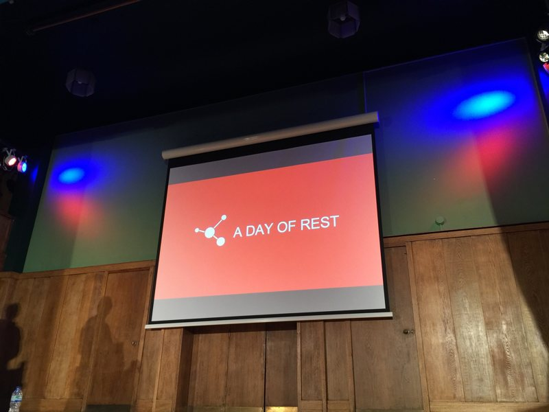
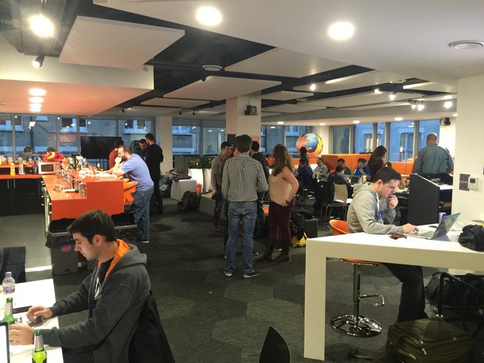

I’m on the train home from London after 2 of days of learning about the new WordPress REST API.

Day one was the conference itself, and the second a hack day. The whole event was organised by [Human Made](https://hmn.md), who’s employees, among others, have been spearheading the project — A project that is going to change people’s attitudes towards websites. It may sound a bit dramatic, but I firmly believe that it’s going to push developers to raise their game and increase experience expectations from web site user’s perspective.

We’ve started to see "single page apps" and native app style web experiences from big players over the past few years, but now with WordPress offering the foundations to build these things right into the core product it opens new doors for everyone. The barrier to entry has been lowered and will continue to lower as it matures, examples and articles are written, and ideas permeate through the very large and active WordPress community.

The talks themselves were all excellent – I’m hard pushed to choose a favourite as they flowed perfectly and progressively built on the ideas presented by the previous speakers. A perfect package of presentations. The day ended with me very excited as to the possibilities. It’s time to dive into JavaScript.

Great after party, too. Beer is expensive in London. That’s just the way it is.

Day 2 brought the "hack day", luckily it didn’t start until 10:30, I was feeling a bit rough because I’d spent too much money the night before. Having never attended a hack day before I wasn’t sure what to expect. I was a bit apprehensive to be honest but I figured "what the hell?"

It was set at the Mozilla offices, which are far nicer than my office and probably nicer than your office too. Around 60 people attended. Starting with people suggesting ideas to "hack on" it immediately felt very relaxed and _community_ like.

I got involved with the documentation, in a team of 7. Firstly we discussed how we’d like to see the documentation improved and then after lunch we got on with it. I got a commit accepted and merged to make it more clear that version 2 docs were available. Not the most exciting or taxing thing in the world, but still, it needed doing.

Next time I’d probably tackle a coding issue now I’m more confident.

I had a great time and I learnt an enormous amount. I’m so pleased to have gone.
