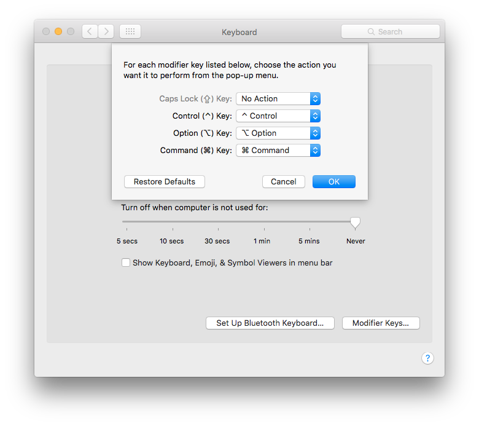
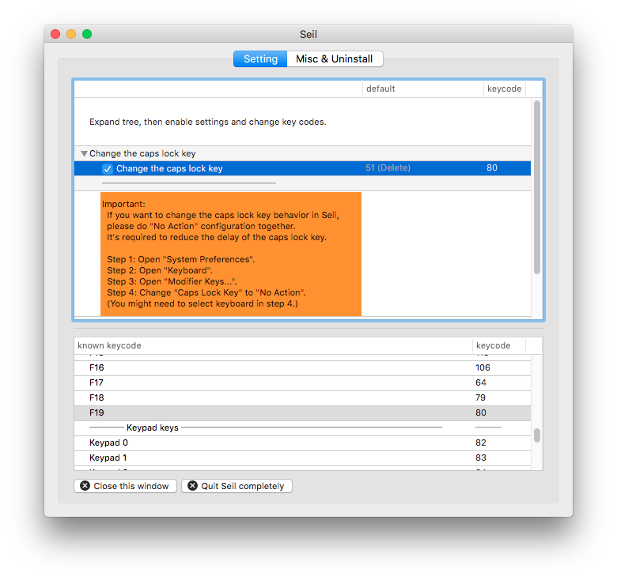
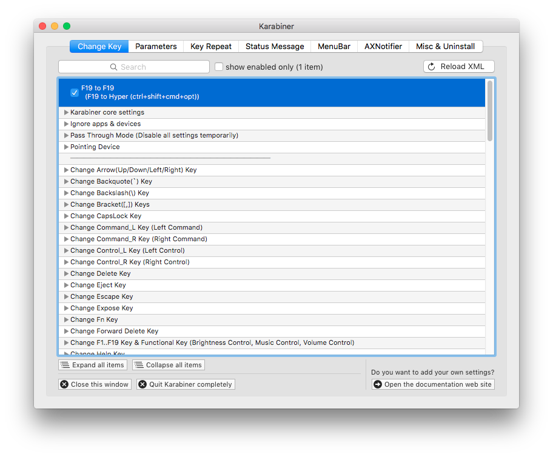
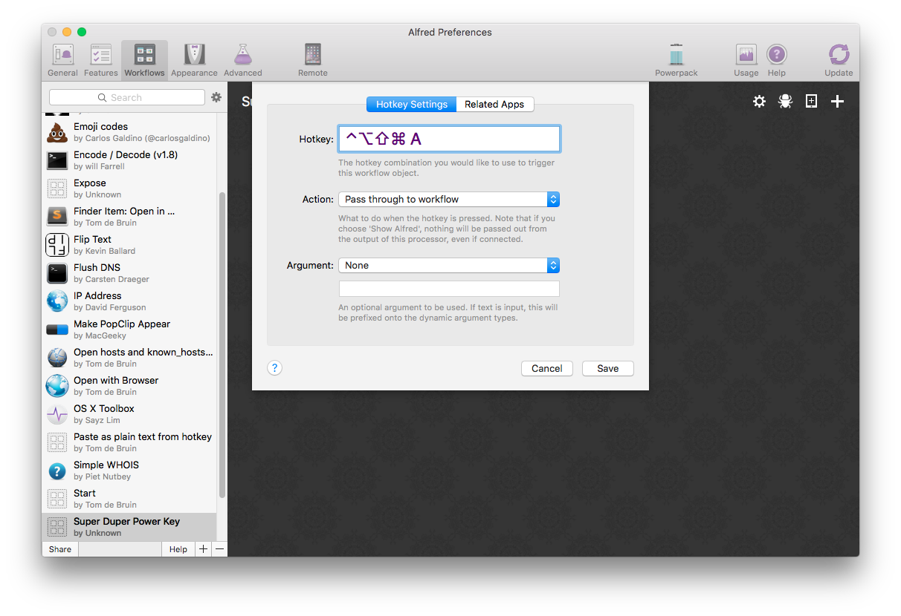

Brett Terpstra (a power user hero) [wrote about this back in 2012](http://brettterpstra.com/2012/12/08/a-useful-caps-lock-key), and here I am documenting my version of it (and the apps have since been renamed).

The capslock key is somewhat useless yet it takes up so much space on the keyboard. Power users (like me, ha) also have a lot of keyboard shortcuts defined and you don’t want to accidentally overwrite existing shortcut keys, so, I’ve remapped my caps lock key to be ⌃⌥⇧⌘ (that’s control, alt, shift, command) all in one go.

Then I use [Alfred App](https://www.alfredapp.com) to create custom commands to launch apps and run scripts based on hotkeys.

Firstly, un-map you caps-lock key from being a caps-lock key.

System Preferences &gt; Keyboard &gt; Modifier Keys… and set Caps Lock to “No Action”.

Secondly, download and install [Seil](https://pqrs.org/osx/karabiner/seil.html.en). Install and set caps lock key to keycode 80, which is F19.

Finally, download and install [Karabiner](https://pqrs.org/osx/karabiner/index.html.en). Go to “Misc & Uninstall” and choose “open private.xml”. Replace the code with…

Go back to “Change Key”, reload “private.xml”, and select “F19 to F19”.

That’s it, you’re now free to create a whole load of shortcuts without risk of overwriting anything. In the Brett Terpstra article he has the key be an escape key on short press and super duper key on long press. I took the escape bit out as I didn’t want that.

Like I said, [Alfred App](https://www.alfredapp.com) lets you create all sorts of commands, like [toggling apps through a hotkey](https://www.alfredapp.com/help/workflows/actions/launch-apps-files).

